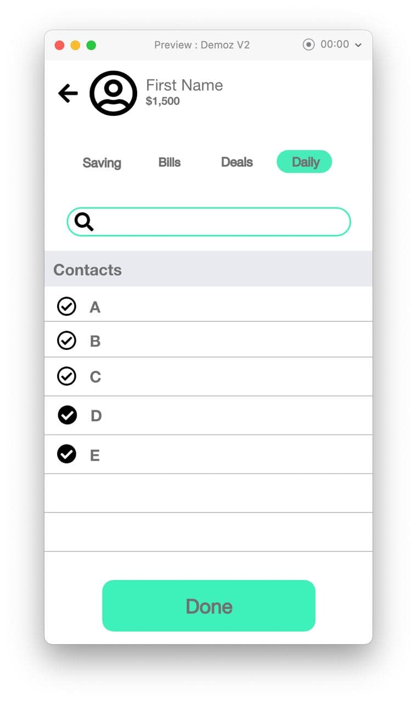
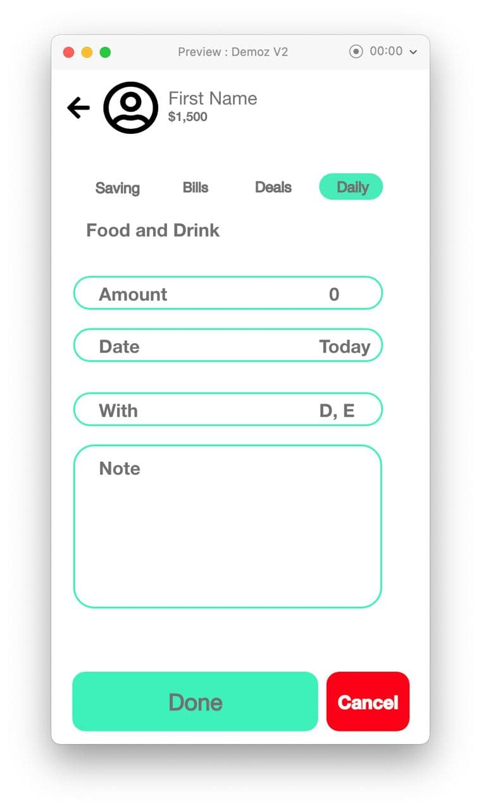
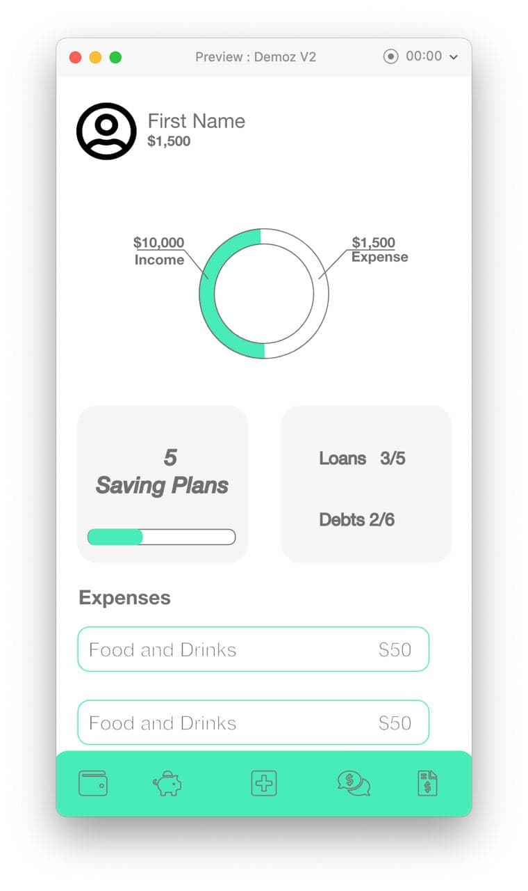
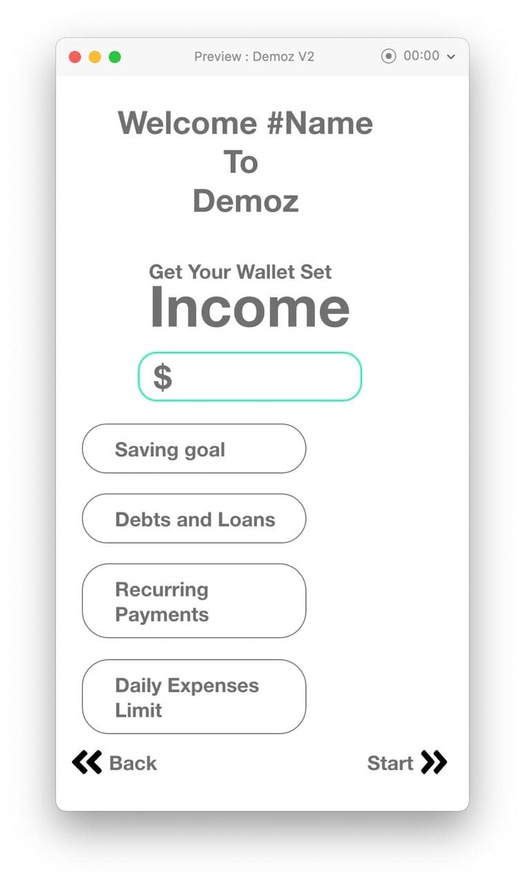
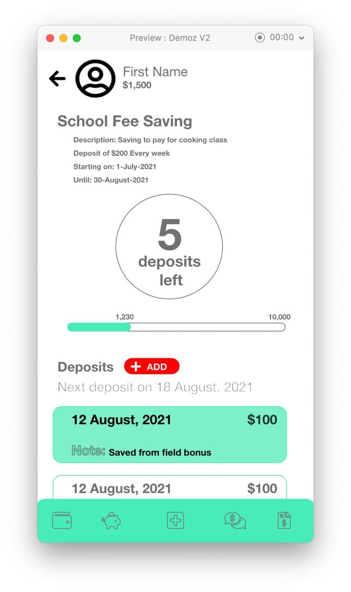
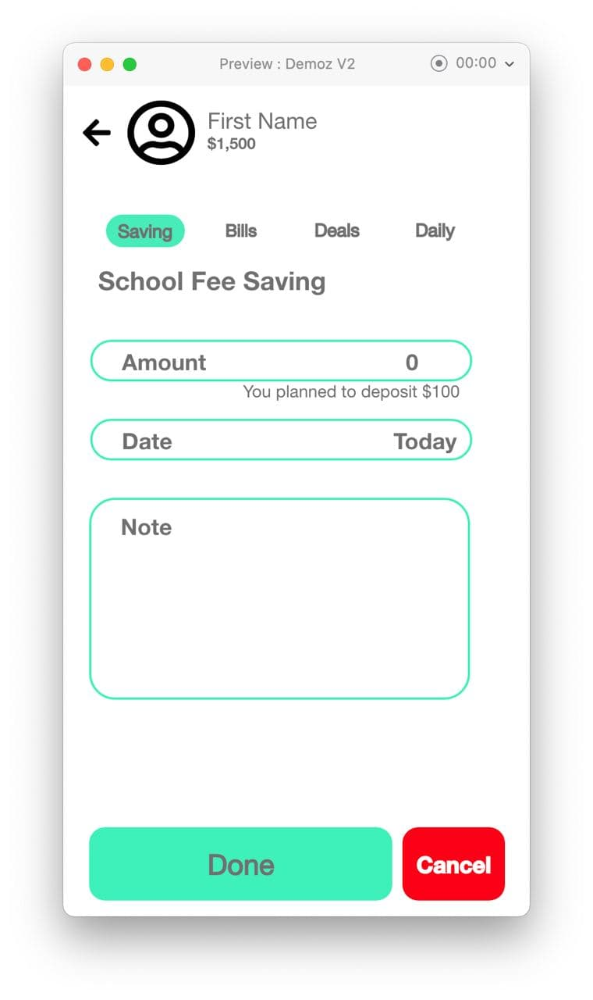

# AMP Project: Demoz Flutter App
// we created separated repo for the back end and front end. https://github.com/EshtaolGirma/DEMOZ_API
Our project is monthly expense managing app what we chose to name it "Demoz" app.

The app is aimed to be used for properly using a monthly income, by providing a mechanism to record and have quick acces to view all income and expenses. it also provide a better way to manage bills with a reminder to when the next payment date is, by calculating it based on the frequency of days inputted by the user. The app motivate to having a saving plan and following it through the plan by showing how many days and money left to reach the user goals. And When it comes to debt and loans it recordes who is the loaner and borrower and the amount of cash involved and the date the deal was made.
A user must first register or (login if they has an account already existing) they to have acces to features of the app provides.
It uses Flutter is an open-source UI software development kit, and Bloc for state management.

we have included 6 business features as listed below
1.User CRUD

2.authentication and authorization

3.notify due date for recurring transaction/payments

4.keep track of saving goal process

5.manage debt and loan payment process

6.record and summarize response

GROUP MEMBERS

1.BEKEN ADUGNA ETR/2532/11

2.ESHTAOL GIRMA ATR/7961/11

3.MIKIYAS DANIEL ATR/1876/11

4.REDIATE BEFEKADU ETR/0042/11

5.ZEKARIYAS ALEMU ATR/2880/11

# UI MODEL

