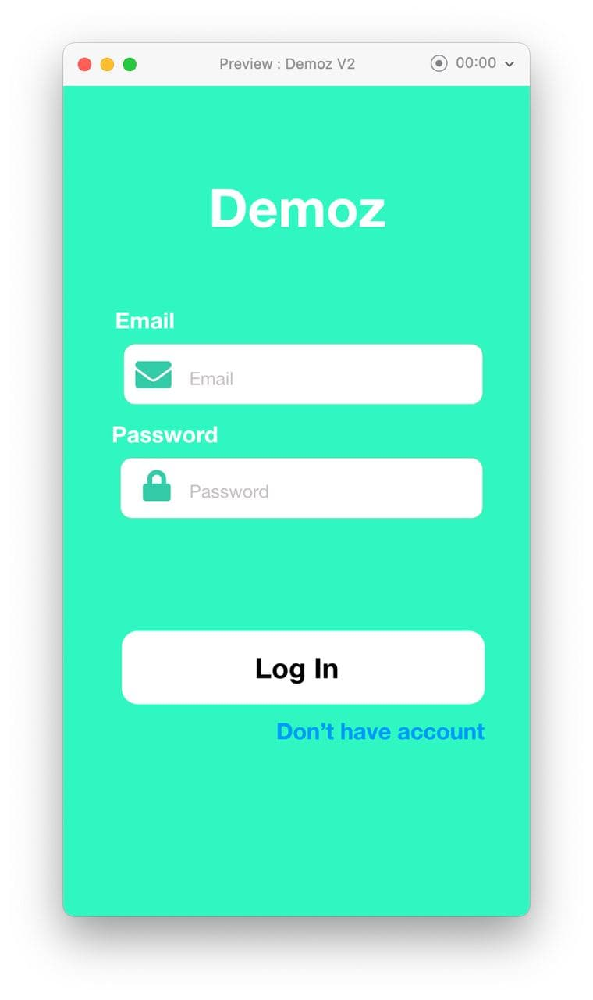

# AMP Project: Demoz API

Our project is monthly expense managing app what we chose to name "Demoz" app.

The app includes the users monthly expense controller, a debt handler, saving recorder, income handler,
a loan handler, and a login and register page.

The app is aimed to be used for properly using a monthly income.
A user must first register to the app or login if he/she has an account that already exist.

we used flutter, flutter_bloc for front end and flask rest-plus as our backend.

we created separated repo for the back end and front end.

we have included 6 business features as listed below
1.User CRUD

2.authentication and authorization

3.notify due date for recurring transaction/payments

4.keep track of saving goal process

5.manage debt and loan payment process

6.record and summarize response

GROUP MEMBERS

1.BEKEN ADUGNA ETR/2532/11

2.ESHTAOL GIRMA ATR/7961/11

3.MIKIYAS DANIEL ATR/1876/11

4.REDIATE BEFEKADU ETR/0042/11

5.ZEKARIYAS ALEMU ATR/2880/11

# UI MODEL

